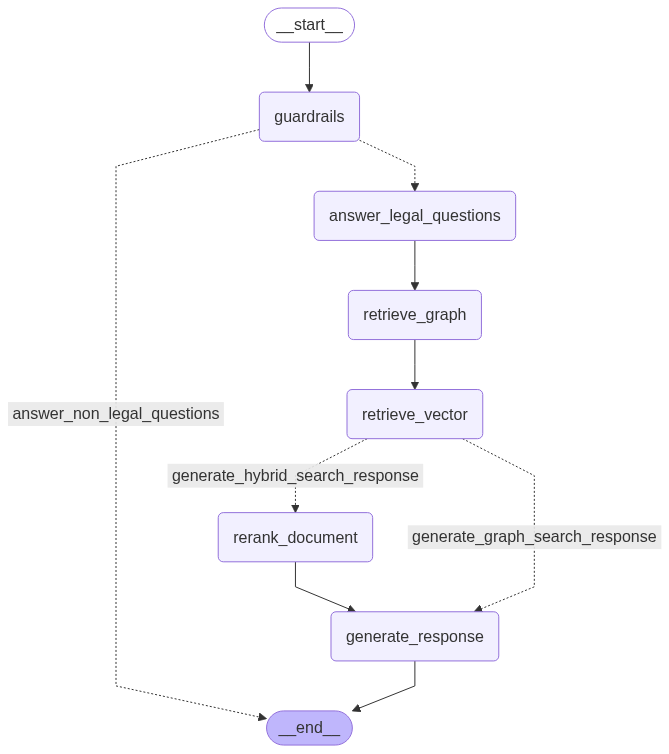
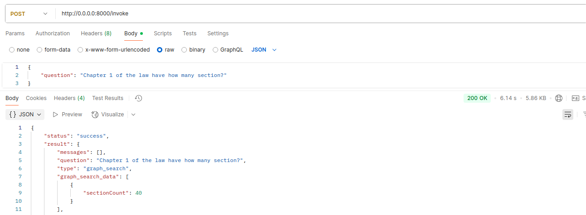

## Overview
This project involves processing text extracted from PDF files, restructuring it into a JSON format with a defined hierarchy, extracting metadata using a Large Language Model (LLM), and building a graph database to represent relationships. The process is implemented in Jupyter notebooks and a FastAPI application.

## Task 1: Data Processing
The task processes a PDF file to extract text, clean it, convert it into a structured JSON format, and extract metadata. Below are the detailed steps:

1. **PDF Text Extraction**:
   - The PDF file is read using the `pdfplumber` library.
   - Extracted text is saved to the `/output/text_data` directory as a text file.

2. **Text Cleaning**:
   - Lines containing the word "strana" are removed from the extracted text to clean the data.

3. **JSON Conversion**:
   - The cleaned text is converted into a JSON file with a hierarchical structure.
   - The JSON object contains the following properties:
     - `type`: Specifies the level in the hierarchy (see below).
     - `title`: The title of the node.
     - `content`: The textual content associated with the node.
     - `metadata`: Additional metadata extracted later.
     - `children`: A list of child nodes representing the next level in the hierarchy.

4. **Hierarchy Structure**:
   The JSON follows a modified hierarchy for legal documents:
   - **Level 0**: Law (ZÁKON)
   - **Level 1**: Part (ČÁST) or Appendix (Příloha)
   - **Level 2**: Chapter (HLAVA) (under Part) or Item (under Appendix)
   - **Level 3**: Section (DÍL) (under Chapter)
   - **Level 4**: Subsection (ODDÍL) (under Section)
   - **Level 5**: Paragraph (§) (under Subsection)
   - **Level 6**: Subsection ((1)) (under Paragraph)
   - The `children` property represents child nodes of the current node, enabling a tree-like structure.

5. **Metadata Extraction**:
   - A Large Language Model (LLM) is used to extract metadata (e.g., references or agency information) from the content.
   - Due to the high computational cost, the LLM is applied to the entire file, taking approximately **20 minutes for a 74-page file**.
   - To manage processing time, the LLM is run on only one file.

6. **Output**:
   - The resulting JSON file, including the hierarchical structure and extracted metadata, is saved to the `/output/json_data` directory.

## Task 2: Graph Construction
After converting the text to JSON, the data is ingested into a graph database. The details are implemented in the `graph_constructing.ipynb` Jupyter notebook.

1. **Graph Ingestion**:
   - Each JSON object is represented as a node in the graph.
   - Edges are created to represent relationships between nodes:
     - `HAS_PART`: Indicates a Part node is a child of a Law node.
     - `HAS_CHAPTER`: Indicates a Chapter node is a child of a Part node.
     - `HAS_SECTION`: Indicates a Section node is a child of a Chapter node.
     - `HAS_SUBSECTION`: Indicates a Subsection node is a child of a Section node.
     - `HAS_PARAGRAPH`: Indicates a Paragraph node is a child of a Subsection node.
     - `REFERENCE`: Indicates a node refers to another node.
     - `HAS_AGENCY`: Indicates which agency is associated with a node.

2. **Most Important Node**:
   - The most critical node in the graph is the **Law (ZÁKON)** node (Level 0), as it serves as the root of the hierarchy and anchors all other nodes. It connects to Part or Appendix nodes via `HAS_PART` edges and may have `REFERENCE` or `HAS_AGENCY` edges based on metadata.
   - **Challenges**:
     - The data is in a language not well understood, making it difficult to interpret the content accurately during processing.
     - The file structure and characteristics (e.g., format, encoding, or specific markers) are not clearly documented, which may lead to inaccuracies in the data processing pipeline and graph construction.
     - Due to the language barrier and the specificity of the data, evaluating the quality of the extracted metadata, node relationships, or overall graph accuracy is challenging.
     - As a result, the project packaging (from data processing to graph construction) may not be fully accurate, and manual validation or additional language expertise may be required.

3. **Implementation**:
   - The graph construction process is detailed in the `graph_constructing.ipynb` notebook.
   - Neo4j is used as the graph database, initialized via Docker Compose using the configuration in `app/docker-compose.yml`.

4. **Setup**:
   - Ensure Neo4j is initialized by running the Docker Compose file before ingesting data into the graph.

## Tasks 3 and 4: Application Development
The project includes a FastAPI application integrated with LangGraph, Neo4j, Qdrant, and Langfuse for tracing. The implementation details are located in the `app` folder.

1. **Architecture**:
   - The graph architecture is visualized in the `graph.png` file.  
     
   - A sample request for the application is provided in the `example_req.png` file.  
     
2. **Technologies**:
   - **FastAPI**: Used to build the API for the application.
   - **LangGraph**: Manages the graph-based workflow.
   - **Neo4j**: Stores the graph data structure.
   - **Qdrant**: Handles vector search capabilities.
   - **Langfuse**: Provides tracing for debugging and monitoring.

3. **Running the Application**:
   - The project can be run using the command:
     ```
     docker compose up app
     ```
   - Ensure the Docker Compose configuration in `app/docker-compose.yml` is set up correctly.

## Implementation Details
- **Task 1**: The full code and detailed processing steps are available in the `process_data.ipynb` Jupyter notebook, including:
  - PDF text extraction using `pdfplumber`.
  - Text cleaning to remove unwanted lines (e.g., "strana").
  - Logic to restructure the text into the specified JSON hierarchy.
  - LLM-based metadata extraction for references and agency information.
- **Task 2**: Graph construction details are in the `graph_constructing.ipynb` notebook.
- **Tasks 3 and 4**: Application code and configurations are in the `app` folder.

## Notes
- The processing time for the LLM in Task 1 is significant (20 minutes for a 74-page file), so it is currently limited to a single file.
- Ensure the `/output/text_data` and `/output/json_data` directories exist before running the code for Task 1.
- For Task 2, initialize Neo4j using the Docker Compose file (`app/docker-compose.yml`) before running the graph ingestion.
- For Tasks 3 and 4, refer to the `app` folder for code details and use the `docker compose up app` command to run the application.
- Rerank implementation part is not applied yet
- Due to the language barrier and lack of clear file documentation, the accuracy of the pipeline (from data processing to graph construction) may be affected. Additional validation or language expertise is recommended to ensure data quality.